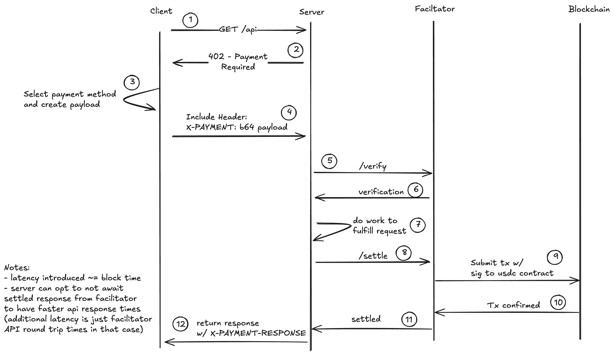

# x402 payments protocol

> "1 line of code to accept digital dollars. No fee, 2 second settlement, $0.001 minimum payment."

```typescript
app.use(
  // How much you want to charge, and where you want the funds to land
  paymentMiddleware("0xYourAddress", { "/your-endpoint": "$0.01" })
);
// That's it! See examples/typescript/servers/express.ts for a complete example. Instruction below for running on base-sepolia.
```

## Philosophy

Payments on the internet are fundamentally flawed. Credit Cards are high friction, hard to accept, have minimum payments that are far too high, and don't fit into the programmatic nature of the internet.
It's time for an open, internet-native form of payments. A payment rail that doesn't have high minimums + % based fee. Payments that are amazing for humans and AI agents.

## Principles

- **Open standard:** the x402 protocol will never force reliance on a single party
- **HTTP Native:** x402 is meant to seamlessly complement the existing HTTP request made by traditional web services, it should not mandate additional requests outside the scope of a typical client / server flow.
- **Chain and token agnostic:** we welcome contributions that add support for new chains, signing standards, or schemes, so long as they meet our acceptance criteria laid out in [CONTRIBUTING.md](https://github.com/coinbase/x402/blob/main/CONTRIBUTING.md)
- **Trust minimizing:** all payment schemes must not allow for the facilitator or resource server to move funds, other than in accordance with client intentions
- **Easy to use:** x402 needs to be 10x better than existing ways to pay on the internet. This means abstracting as many details of crypto as possible away from the client and resource server, and into the facilitator. This means the client/server should not need to think about gas, rpc, etc.

## Ecosystem

The x402 ecosystem is growing! Check out our [ecosystem page](https://x402.org/ecosystem) to see projects building with x402, including:

- Client-side integrations
- Services and endpoints
- Ecosystem infrastructure and tooling
- Learning and community resources

Want to add your project to the ecosystem? See our [demo site README](https://github.com/coinbase/x402/tree/main/typescript/site#adding-your-project-to-the-ecosystem) for detailed instructions on how to submit your project.

**Roadmap:** see [ROADMAP.md](https://github.com/coinbase/x402/blob/main/ROADMAP.md)

## Terms:

- `resource`: Something on the internet. This could be a webpage, file server, RPC service, API, any resource on the internet that accepts HTTP / HTTPS requests.
- `client`: An entity wanting to pay for a resource.
- `facilitator server`: A server that facilitates verification and execution of on-chain payments.
- `resource server`: An HTTP server that provides an API or other resource for a client.

## Technical Goals:

- Permissionless and secure for clients and servers
- Gasless for client and resource servers
- Minimal integration for the resource server and client (1 line for the server, 1 function for the client)
- Ability to trade off speed of response for guarantee of payment
- Extensible to different payment flows and chains

## V1 Protocol

The `x402` protocol is a chain agnostic standard for payments on top of HTTP, leverage the existing `402 Payment Required` HTTP status code to indicate that a payment is required for access to the resource.

It specifies:

1. A schema for how servers can respond to clients to facilitate payment for a resource (`PaymentRequirements`)
2. A standard header `X-PAYMENT` that is set by clients paying for resources
3. A standard schema and encoding method for data in the `X-PAYMENT` header
4. A recommended flow for how payments should be verified and settled by a resource server
5. A REST specification for how a resource server can perform verification and settlement against a remote 3rd party server (`facilitator`)
6. A specification for a `X-PAYMENT-RESPONSE` header that can be used by resource servers to communicate blockchain transactions details to the client in their HTTP response

### V1 Protocol Sequencing



The following outlines the flow of a payment using the `x402` protocol. Note that steps (1) and (2) are optional if the client already knows the payment details accepted for a resource.

1. `Client` makes an HTTP request to a `resource server`.

2. `Resource server` responds with a `402 Payment Required` status and a `Payment Required Response` JSON object in the response body.

3. `Client` selects one of the `paymentRequirements` returned by the server response and creates a `Payment Payload` based on the `scheme` of the `paymentRequirements` they have selected.

4. `Client` sends the HTTP request with the `X-PAYMENT` header containing the `Payment Payload` to the resource server.

5. `Resource server` verifies the `Payment Payload` is valid either via local verification or by POSTing the `Payment Payload` and `Payment Requirements` to the `/verify` endpoint of a `facilitator server`.

6. `Facilitator server` performs verification of the object based on the `scheme` and `network` of the `Payment Payload` and returns a `Verification Response`.

7. If the `Verification Response` is valid, the resource server performs the work to fulfill the request. If the `Verification Response` is invalid, the resource server returns a `402 Payment Required` status and a `Payment Required Response` JSON object in the response body.

8. `Resource server` either settles the payment by interacting with a blockchain directly, or by POSTing the `Payment Payload` and `Payment PaymentRequirements` to the `/settle` endpoint of a `facilitator server`.

9. `Facilitator server` submits the payment to the blockchain based on the `scheme` and `network` of the `Payment Payload`.

10. `Facilitator server` waits for the payment to be confirmed on the blockchain.

11. `Facilitator server` returns a `Payment Execution Response` to the resource server.

12. `Resource server` returns a `200 OK` response to the `Client` with the resource they requested as the body of the HTTP response, and a `X-PAYMENT-RESPONSE` header containing the `Settlement Response` as Base64 encoded JSON if the payment was executed successfully.

## Getting Started with FastSet Demo

Follow these step-by-step instructions to set up and run the x402 demo with FastSet network support.

### Prerequisites

Before you begin, ensure you have the following installed:

- **Node.js** v20 or higher (install via [nvm](https://github.com/nvm-sh/nvm))
- **pnpm** v10 or higher (install via [pnpm.io/installation](https://pnpm.io/installation))
- **FastSet Wallet Extension** ([Chrome Web Store](https://chromewebstore.google.com/detail/fastset-wallet/ghibjknldlhfffnckpencpcjbhefblbe)) - Required for making FastSet payments
- A FastSet wallet address (bech32 format, e.g., `set1...`) to receive payments

### Step 1: Clone and Install Dependencies

1. Navigate to the project root directory:
```bash
cd fastset-x402-demo
```

2. Navigate to the TypeScript examples directory and install all dependencies:
```bash
cd examples/typescript
pnpm install
```

3. Build the required packages. The `next-advanced` example may fail to build, but that's okay - you only need the core packages for the FastSet demo.

   Go to `examples/typescript` and run:

   **Recommended: Build only the packages needed for FastSet demo:**
   ```bash
   pnpm turbo build --filter=x402 --filter=x402-next --filter=next-example --filter=facilitator-example
   ```

   Then to `typescript/packages/x402` from the root of the repo and run:

   ```bash
   pnp build:paywall
   ```
   
### Step 2: Set Up the Facilitator Server

The facilitator server handles payment verification for FastSet payments. FastSet support is enabled by default and doesn't require a private key.

1. Navigate to the facilitator directory:
```bash
cd facilitator
```

2. Copy the environment template and configure if needed:
```bash
cp .env-local .env
```

3. The facilitator supports FastSet by default. Your `.env` file should look like this:
```bash
# FastSet support is enabled by default (no private key needed)
# ENABLE_FASTSET=true
PORT=3002
```

**Note:** If you want to also support EVM or Solana networks, you can add:
```bash
EVM_PRIVATE_KEY=0xYourPrivateKey  # Optional, for EVM networks
SVM_PRIVATE_KEY=base58EncodedSolanaPrivateKey  # Optional, for Solana networks
```

4. Start the facilitator server:
```bash
pnpm dev
```

The facilitator will start on `http://localhost:3002`. Keep this terminal running.

### Step 3: Run the Next.js Demo

```bash
cd examples/typescript/fullstack/next
cp .env.sample .env.local
pnpm dev
```

**Note:** Update `RESOURCE_WALLET_ADDRESS` in `.env.local` with your FastSet wallet address. The app runs on `http://localhost:3000`.

### Step 4: Set Up FastSet Wallet

   - Open Chrome, Brave, or Edge browser
   - Install the [FastSet Wallet Extension](https://chromewebstore.google.com/detail/fastset-wallet/ghibjknldlhfffnckpencpcjbhefblbe)

### Step 5: Test the Payment Flow

1. **Open the Protected Route:**
   - Navigate to `http://localhost:3000/protected` in your browser
   - You should see a payment paywall requiring $100 (as configured in the middleware)

2. **Connect Your Wallet:**
   - Click the "Connect FastSet Wallet" button
   - Approve the connection request in your FastSet wallet extension

3. **Make a Payment:**
   - Once connected, click "Pay Now"
   - Review the payment details in the wallet popup
   - Approve the payment in your FastSet wallet
   - The payment will be executed immediately (FastSet uses sign-and-send)

4. **Access Protected Content:**
   - After successful payment verification, you should see the protected content
   - The payment certificate is verified by the facilitator server


## FastSet Network Integration

This is an integration for x402 with the Pi2 FastSet network. The x402 protocol enables blockchain-agnostic payments for protected content, and this integration extends support to [FastSet](https://pi2.network/fastset-network) alongside existing EVM networks (Base, Base Sepolia, Avalanche, Polygon, etc.) and SVM networks (Solana).

### System Overview

The integration works through several interconnected components that collectively enable FastSet payments within the x402 protocol framework:

**Technical Architecture**: The system extends the existing x402 multi-blockchain architecture through a discriminated union type system that provides compile-time safety and runtime validation for FastSet payments. The core integration leverages TypeScript's type system to define FastSet-specific interfaces (`FastSetAccountInfo`, `FastSetWallet`, `FastSetTransactionCertificate`, `ExactFastSetPayload`) that seamlessly integrate with the existing EVM (Base, Avalanche, Polygon, etc.) and SVM (Solana) type definitions, ensuring type safety from wallet interaction through facilitator verification.

**Payment Flow Infrastructure**: The implementation follows a layered architecture where payment handler components orchestrate payment flows, and x402 clients translate between FastSet wallet extension APIs and protocol-compliant payment headers. The system uses a client pattern for wallet integration that mirrors existing EVM and SVM blockchain implementations, enabling consistent behavior across all supported networks while handling FastSet-specific connection management, account detection, and payment signing.

**Protocol Integration**: At the protocol level, the system extends the x402 exact payment scheme to support FastSet payment headers through client-side payment creation and server-side facilitator verification. The middleware automatically detects FastSet payment requirements and activates the appropriate payment flow, while the facilitator infrastructure provides a framework for payment verification against FastSet using RPC calls to the FastSet proxy network. The configuration system uses environment-based payment requirements that define token addresses, amounts, recipient addresses, and network parameters, enabling flexible deployment across different environments.

**End-to-End Flow**: The complete payment process begins when users encounter x402-protected content with FastSet payment requirements. The system automatically renders FastSet as a payment option, manages wallet extension detection and connection, handles payment creation and signing through the FastSet wallet API, generates x402-compliant payment headers, submits payments for facilitator verification, and grants content access upon successful payment validation. This flow maintains consistency with existing blockchain implementations while accommodating FastSet-specific payment formats and wallet interaction patterns.

### Implementation Details

In order to add FastSet support, we added the following:

### 1. Add FastSet Types and Schemas

The type system forms the foundation of FastSet integration by providing compile-time safety and runtime validation. These types define the interface between the FastSet wallet extension, the x402 protocol, and the application layer. The discriminated union approach ensures that FastSet payments are handled correctly throughout the system while maintaining compatibility with existing EVM and Solana payment types.

The schema definitions enable automatic validation of FastSet payment payloads, ensuring that malformed or incompatible payments are rejected early in the process. This type safety extends from the wallet interaction layer through to the facilitator verification process.

**Files added:**
- **Core FastSet types** in `typescript/packages/x402/src/types/shared/fastset.ts` - Defines `FastSetAccountInfo`, `FastSetTransactionCertificate`, `FastSetTransferParams`, `FastSetWallet`, and `FastSetConnectedClient` interfaces that represent the FastSet wallet extension API and RPC client

**Files modified:**
- **Payment payload types** in `typescript/packages/x402/src/types/verify/fastsetPayload.ts` - Defines `ExactFastSetPayload` structure for x402 protocol compatibility with payment certificates
- **Network type extensions** in `typescript/packages/x402/src/types/shared/network.ts` - Adds FastSet as a supported network type (`fastset-devnet`) with network identification utilities and `SupportedFastSetNetworks` array
- **Client type extensions** in `typescript/packages/x402/src/types/shared/wallet.ts` - Extends payment client interfaces to support FastSet wallet integration through `ConnectedClient` union type and `createConnectedClient` function
- **x402 specification updates** in `typescript/packages/x402/src/types/verify/x402Specs.ts` - Updates discriminated union schemas to include FastSet payment payloads with bech32 address validation (`FastSetAddressRegex`)
- **Type exports** in `typescript/packages/x402/src/types/shared/index.ts` and `typescript/packages/x402/src/types/verify/index.ts` - Added FastSet type exports

### 2. Add FastSet Payment Client

The client integration provides the core functionality for creating x402-compliant payment headers using FastSet wallets. This implementation handles the translation between FastSet wallet extension APIs and the x402 protocol requirements. The client manages payment creation, signing, and formatting to ensure compatibility with the x402 payment verification process.

The integration extends the existing x402 client architecture to support FastSet alongside EVM and Solana clients. The payment header creation process maintains the same interface while handling FastSet-specific payment formats and wallet interaction patterns. FastSet payments are executed immediately when created (sign-and-send), so the client returns payment certificates rather than pending payment signatures.

**Files added:**
- **FastSet payment client** in `typescript/packages/x402/src/schemes/exact/fastset/client.ts` - Core client implementation that interfaces with FastSet wallet extension to create payments using the `transfer` method
- **FastSet scheme index** in `typescript/packages/x402/src/schemes/exact/fastset/index.ts` - Exports FastSet client functions
- **Shared client utilities** in `typescript/packages/x402/src/shared/client.ts` - Added `createFastSetClient` function to support FastSet payment clients

**Files modified:**
- **Payment header creation** in `typescript/packages/x402/src/client/createPaymentHeader.ts` - Updated to support FastSet networks and route to FastSet client
- **Payment requirement selection** in `typescript/packages/x402/src/client/selectPaymentRequirements.ts` - Added FastSet network support
- **Scheme integration** in `typescript/packages/x402/src/schemes/exact/index.ts` - Added FastSet exports to the exact payment scheme
- **Shared exports** in `typescript/packages/x402/src/shared/index.ts` - Added FastSet client exports

### 3. Add FastSet Paywall Component

The FastSet paywall component integrates into the existing paywall system to provide a seamless payment experience. The `FastSetPaywall` component orchestrates the entire payment flow, from wallet connection through payment completion. It integrates with the FastSet wallet extension to manage connection state and provides user feedback throughout the payment process.

The component follows the same interface pattern as existing EVM and Solana payment handlers, ensuring consistent behavior and user experience across all supported networks. Integration into the main paywall system enables automatic detection and rendering of FastSet payment options based on the configured payment requirements.

**Files added:**
- **FastSetPaywall** in `typescript/packages/x402/src/paywall/src/FastSetPaywall.tsx` - React component that handles FastSet payment flow including wallet connection, payment processing, and payment signing

**Files modified:**
- **Paywall integration** in `typescript/packages/x402/src/paywall/src/PaywallApp.tsx` - Updates main paywall component to detect and render FastSet payment options when FastSet payment requirements are present
- **Paywall utilities** in `typescript/packages/x402/src/paywall/src/paywallUtils.ts` - Added `isFastSetNetwork` function and FastSet network detection logic
- **Paywall template** in `typescript/packages/x402/src/paywall/gen/template.ts` - Updated to include FastSet paywall component

### 4. Add Facilitator for FastSet

The facilitator integration provides server-side infrastructure for FastSet payment verification and settlement, following the same architectural patterns as existing EVM and Solana facilitators.

**Key Features:**
- **Network Integration**: Direct RPC calls to FastSet proxy network (`https://proxy.fastset.xyz/`) using `set_proxy_getAccountInfo` method
- **Payment Verification**: Validates payment nonce, sender/recipient addresses, and transfer amounts against network state by querying account information with certificate-by-nonce
- **Simple Settlement**: Payments are settled in the wallet when created, so the settle function acts as a pass-through after verification

**Files added:**
- **FastSet verification** in `typescript/packages/x402/src/verify/fastset.ts` - Complete verification and settlement logic with RPC integration, including payment certificate validation using `set_proxy_getAccountInfo` RPC method
- **Exact scheme facilitator** in `typescript/packages/x402/src/schemes/exact/fastset/facilitator.ts` - Facilitator routing for FastSet namespace within the exact payment scheme, implementing `verify` and `settle` functions

**Files modified:**
- **Core facilitator integration** in `typescript/packages/x402/src/facilitator/facilitator.ts` - Routes FastSet payments to appropriate handlers in the main `verify` and `settle` functions, adding FastSet network checks alongside EVM and SVM
- **Verify exports** in `typescript/packages/x402/src/verify/index.ts` - Added FastSet verification exports
- **Example facilitator** in `examples/typescript/facilitator/index.ts` - Updated to support FastSet network routing in the facilitator server, including FastSet network detection and client creation

The implementation uses FastSet's certificate-based payment model, where payments are immediately executed and verified through RPC calls that check account state and payment certificates.

### 5. Middleware and Configuration Support

The middleware integration enables automatic FastSet payment flow activation when FastSet payment requirements are present. The system uses environment variables to configure facilitator endpoints, enabling flexible deployment across development, testing, and production environments.

**Files modified:**
- **Middleware support** in `typescript/packages/x402/src/shared/middleware.ts` - Added FastSet network detection, default asset configuration (native SET token with address `0xfa575e7000000000000000000000000000000000000000000000000000000000`), and FastSet-specific payment requirement handling
- **Network utilities** in `typescript/packages/x402/src/shared/network.ts` - Added FastSet network mapping and cluster identification
- **Next.js middleware** in `typescript/packages/x402-next/src/index.ts` - Extended payment middleware to support FastSet networks with bech32 address handling, including FastSet payment requirement construction
- **Example configurations** in `examples/typescript/fullstack/next/README.md` and `examples/typescript/fullstack/next/middleware.ts` - Updated to demonstrate FastSet payment setup with devnet network and native SET token
- **EVM utilities** in `typescript/packages/x402/src/schemes/exact/evm/utils/paymentUtils.ts` - Updated payment utilities to handle FastSet networks in payment parsing and formatting
- **EVM facilitator** in `typescript/packages/x402/src/schemes/exact/evm/facilitator.ts` - Updated to exclude FastSet networks from EVM verification
- **EVM signing** in `typescript/packages/x402/src/schemes/exact/evm/sign.ts` - Updated to exclude FastSet networks from EVM signing flow

**Setup Requirements:** To test the integration, you need to configure payment requirements with FastSet network (`fastset-devnet`), use bech32 addresses for `payTo` fields, and ensure the facilitator supports FastSet verification. The system uses the `FACILITATOR_URL` environment variable to point to the facilitator instance for development and testing.

### Implementation Status

This integration provides a complete implementation for FastSet payments within the x402 protocol. The implementation includes client-side wallet integration, payment UI components, facilitator verification with RPC integration, and configuration management. The system successfully demonstrates end-to-end FastSet payment flow from wallet connection through payment completion and verification.
